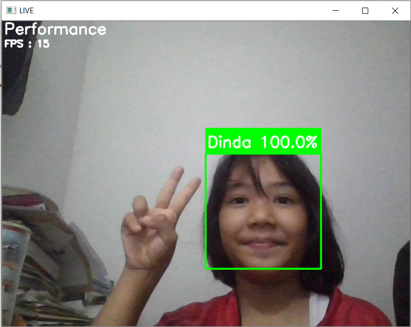

# Realtime Face Detection

> Build & execute your face detection model in single step

a realtime face detection using `Open CV`, `Keras`, & `Tensorflow`. 

### This whole program contain:

1. Facial Image Data Extraction<br>
Extracting target facial image with `webcam` by `Open CV`.

<p align="center">
  
</p>

2. Modelling<br>
Make a model using extracted facial image data to classified items using `Keras` & `Tensorflow`

3. Live Detection<br>
Live detection using trained model via `webcam`

## Clone This Repositories

You can clone this repositories via download by `ZIP` or via `git`

```
git clone https://github.com/Hyuto/realtime-facedetection.git
```

## Install Requirements

> :warning: **Stable and Strong Internet Connection Needed**: If you haven't installed `tensorflow` and `Open CV` it would take roughly **600MB** to install

Install requirements via pip

```
pip install -r requirements.txt
```

## Magic in `config.json`

`config.json` is all you need to setup your running environment find more about it [Here](https://github.com/Hyuto/realtime-facedetection/wiki/Magic-config.json) 

## Quick Setup

> Absolute beginners tutorial [Here](https://github.com/Hyuto/realtime-facedetection/wiki/For-Absolute-Beginners)

Make sure you've already clone this repositories and installed the requirements. 

1 Open terminal and cd to `realtime-facedetection` folder

2 Open `config.json`<br>
You can open it via whatever you like, but let's just open it using notepad.

```
notepad config.json
```

3 Add value inside array of `PERSONS`<br>
You can fill it by your name or some other more.<br>
<br>
you can set it for more than 1 person by adding their names.

```json
"PERSONS":[
    "Hyuto",
    "Hyuto_Friend_1",
    "etc"
]
```

4 Save and Run<br>
Save the changes of `config.json` in windows you can type `CTRL+S` for shortcut key and then the last step is run the `setup.py`

```
python setup.py run
```

that's it all you've to do now is follow the instruction on your terminal.

Example Log:


